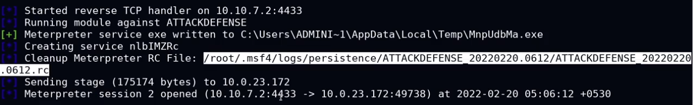
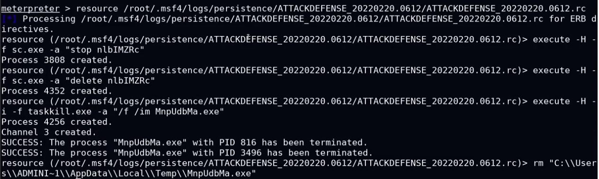

# 8. Clearing Tracks
TCM

*   Make the system/network as it was when you entered it 
    *   Remove executables, scripts, and added files
    *   Remove malware, rootkits, and added user accounts
    *   Set settings back to original configurations

* * *

*   The exploitation and post-exploitation phases of a penetration test involves actively engaging with target systems and the data that is stored on these systems.
*   As a result, you may be required to clear/undo any changes you have made to the target systems you have compromised based on the guidelines specified in the rules of engagement.
*   If you have transferred any files to the target systems you have compromised, keep track of where they have been saved so that you can remove them when done.
*   A good practice is to store all your scripts, exploits and binaries in the C:/Temp directory on Windows and the /tmp directory on Linux.
*   It is also important to consider the exploitation framework you are using, an example of this is MSF, which is notorious for generating and storing artifacts on the target system when using exploit or post modules.
*   Some well designed MSF modules provide you with instructions and resource scripts that provide you with information regarding where the artifacts are stored and how they can be removed.
*   In the context of Windows, a typical post-exploitation technique pertinent to clearing your tracks is to delete the Windows Event Log. This is something that should be avoided during a penetration test as the Windows Event Log stores a lot of data that is important to the client you are performing the penetration test for.

_**Windows Event Logs**_
------------------------

*   The Windows OS stores and catalogs all actions/events performed on the system and stores them in the Windows Event log.
*   Event logs are categorized based on the type of events they store:
    *   **Application logs**: Stores application/program events like startups, crashes etc.
    *   **System logs**: Stores system events like startups, reboots etc. 
    *   **Security logs**: Stores security events like password changes, authentication failures etc.
*   Event logs can be accessed via the Event Viewer on Windows.
*   The event logs are the first stop for any forensic investigator after a compromise has been detected. It is therefore very important to clear your tracks after you are done with your assessment.
*   _**Practical Windows + Linux**_
    *   on target system > Event Viewer
    *   meterpreter > `clearev` - entire windows event logs are deleted
    *   Delete Payload Manually
*   _**Practical Linux Only**_
    *   `cat .bash_history` - bash all command run in previous (history)
    *   `cat /dev/null > .bash_history`
    *   `history -c` - clear history